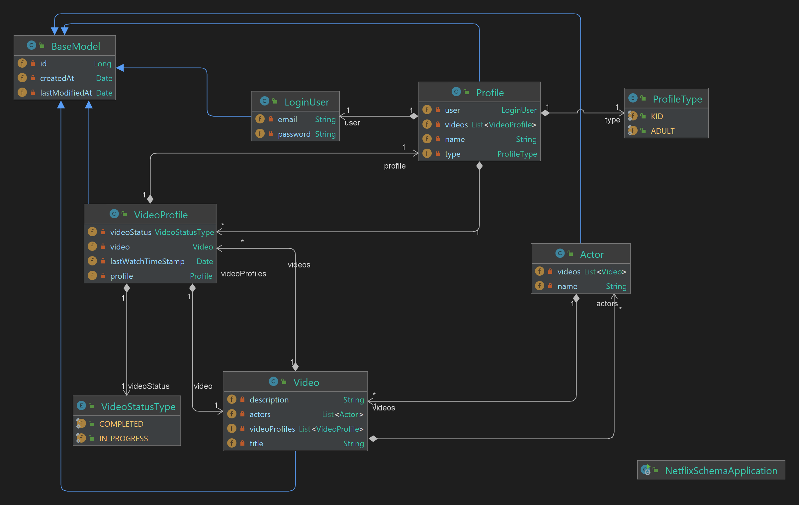

`postgres=# create user sanket with password 'sanket';`

CREATE ROLE

`postgres=# create database netflix__schema;`

CREATE DATABASE

`postgres=# grant all privileges on database netflix__schema to sanket;`

GRANT

---
### Class Diagram

---
### Schema Diagram

TODO